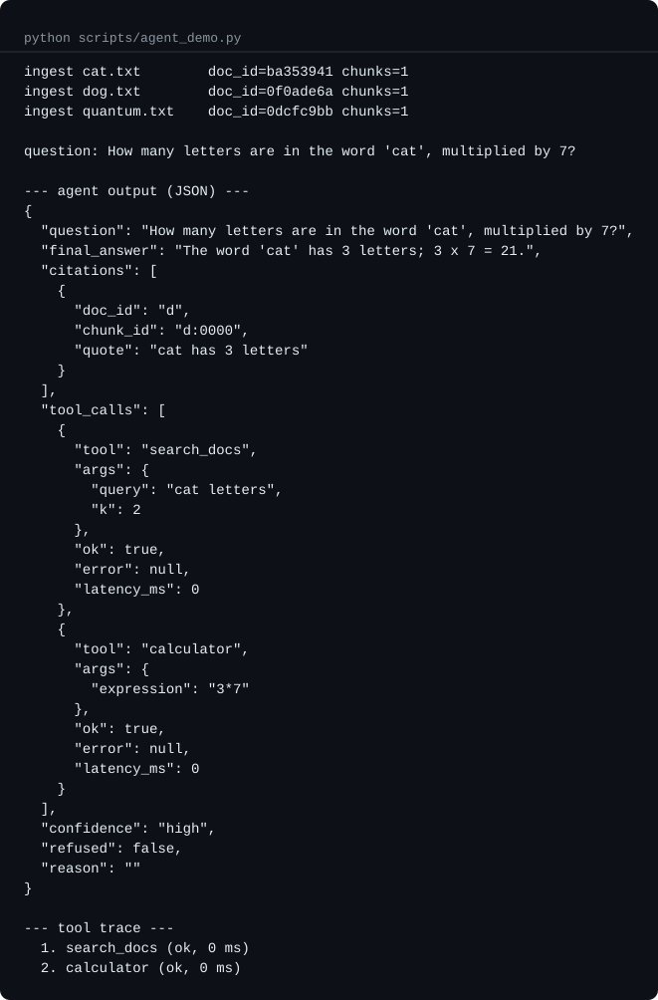
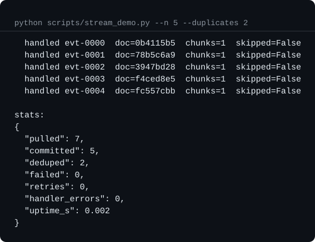
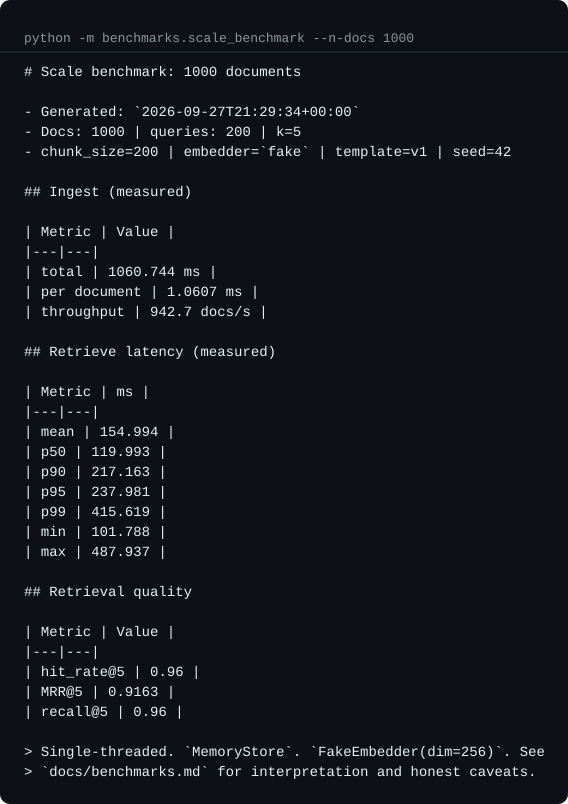

# rag-agent-platform

> A production-minded RAG + AI agent backend with tool-calling, structured outputs, and a reproducible evaluation loop.

[](https://github.com/WoodinGlass/rag-agent-platform/actions/workflows/ci.yml)
[](https://github.com/WoodinGlass/rag-agent-platform/blob/main/evals/reports/latest.md)
[-brightgreen)](docs/provider-smoke.md)


---

## Preview

<p align="center">
  
</p>

<p align="center">
  <em>Multi-hop agent loop: <code>search_docs</code> → <code>calculator</code> → finish, returning a Pydantic-validated <code>AgentOutput</code>.</em>
</p>

<table>
<tr>
  <td align="center"></td>
  <td align="center"></td>
</tr>
<tr>
  <td align="center"><em>Streaming ingest with dedup</em></td>
  <td align="center"><em>1k-doc scale benchmark</em></td>
</tr>
</table>

---

## Problem (one sentence)

Developers need a **reusable, testable, and observable RAG + agent backend** that ingests arbitrary documents, retrieves grounded context, executes tools, and returns **structured JSON** — instead of one-off notebooks glued to a single LLM provider.

## What this is / is not

| This is | This is not |
|---|---|
| Backend service (FastAPI) + evaluation harness | A UI / chatbot frontend |
| Provider-agnostic LLM layer (OpenAI / Anthropic) | Tied to a single vendor SDK |
| Deterministic ingestion + retrieval, non-deterministic generation | Fully deterministic pipeline |
| Portfolio-grade with CI, tests, Docker, evals | Production SaaS with billing / multi-tenant |

---

## Tech stack

- **Runtime:** Python 3.11+, FastAPI, Uvicorn
- **Agent loop:** two backends behind one `AgentBackend` protocol — a deterministic state machine (default) and a LangGraph `StateGraph` (opt-in via `AGENT_BACKEND=langgraph`)
- **LLM providers:** OpenAI, Anthropic (pluggable via `LLM` protocol; `FakeLLM` for tests)
- **Vector store:** three backends behind one `VectorStore` ABC, selected by `VECTOR_BACKEND`: `MemoryStore` (tests, in-process), `ChromaStore` (local files, `[vector]`), `QdrantStore` (service, `[qdrant]`)
- **Reranker:** Identity (default), Fake (heuristic for tests), Cross-encoder (opt-in via `[rerank]`)
- **Schemas:** Pydantic v2 (`extra="forbid"` for contract enforcement)
- **Eval:** offline retrieval metrics (hit-rate, MRR, precision, recall) on every PR; Ragas (faithfulness, answer relevancy, context precision) via LLM judge on weekly/manual runs
- **Observability:** structured JSON logs + correlation id; `/metrics` endpoint; OpenTelemetry traces (opt-in, console or OTLP exporter)
- **Auth:** opt-in API-key multi-tenant (X-API-Key); tenant propagated via contextvar through the agent loop
- **Request limits:** opt-in token-bucket rate limit (per key/IP) + Content-Length body size cap; stdlib only, in-process
- **Streaming ingestion:** `EventSource` protocol; `InMemoryQueueSource`, `KafkaEventSource`, `S3ObjectSource` adapters; `ParallelIngestor` with consumer-group rebalance hooks
- **Packaging:** `pyproject.toml` (single source of truth)
- **Infra:** Docker + docker-compose, GitHub Actions CI (lint + type + coverage + docker smoke + eval)

---

## Architecture

```text
 [docs] --> [Ingest] --> chunk --> embed --> [Vector Store]
                                                    |
                                                    v
 [query] --> [FastAPI] --> [RAG Pipeline] --> [Agent Loop]
                                                    |
                                       plan -> tool_call -> observe -> finish
                                                    |
                                                    v
                                        [Structured JSON output]
                                        (AgentOutput, Pydantic-validated)
```

### Design decisions (Phase 0 pre-flight)

| Decision | Choice | Rationale |
|---|---|---|
| **Deterministic vs non-deterministic** | Ingest + retrieval deterministic; generation non-deterministic | Enables re-ingest without duplicates |
| **Payload vs pipeline** | Payload = documents + embeddings; Pipeline = chunk → embed → retrieve → generate | Clear separation for testing |
| **Storage tier** | Small structured: SQLite (dev) / Postgres (prod). Vectors: `MemoryStore` → `ChromaStore` → `QdrantStore`, all behind one `VectorStore` ABC | No refactor when scaling |
| **Ingestion mode** | Batch first; streaming behind a protocol | Same contract, two adapters |
| **Idempotency key** | `sha256(file_bytes) + chunker_version` (+ tenant namespace) | Re-ingest is a no-op |
| **Agent loop** | Two backends, one protocol; state machine default, LangGraph opt-in | Choice without rewrite; parity-tested |
| **Pure vs IO** | Tools pure; IO in `tools/adapters/` | Unit tests never touch network/disk |
| **Multi-tenant** | Opt-in; tenant-scoped doc ids + contextvar propagation | Single-tenant deploy stays simple |
| **Request limits** | Opt-in; in-process token bucket + Content-Length cap | Zero config for demo; single-line switch for production |
| **Tracing** | Opt-in; no-op default; lazy SDK | Zero cost when off |
| **Delivery semantics** | At-least-once + idempotent handler = effectively-once | Kafka EOS does not apply to a Kafka→vector-store topology |
| **Failure modes** | LLM timeout → retry w/ jitter. Store down → circuit breaker. API → 503 + CID in logs | See `docs/runbooks/` |

---

## Repository layout

```text
rag-agent-platform/
├── app/
│   ├── agents/              # agent loop(s), registry, schema, prompts, bootstrap
│   │   ├── agent.py         # state machine backend (default)
│   │   ├── langgraph_backend.py  # StateGraph backend (opt-in)
│   │   ├── backend.py       # AgentBackend protocol
│   │   ├── bootstrap.py     # config-driven factory
│   │   ├── llm.py           # LLM protocol + FakeLLM
│   │   ├── prompts.py       # versioned system prompt + tool renderer
│   │   ├── registry.py      # ToolRegistry
│   │   └── schema.py        # AgentOutput / Citation / ToolCall
│   ├── rag/                 # chunker, embedder, store, pipeline, reranker
│   │   ├── store.py         # VectorStore ABC + MemoryStore + lazy ChromaStore
│   │   ├── qdrant_store.py  # QdrantStore (opt-in [qdrant] extra)
│   │   └── reranker.py      # Identity / Fake / CrossEncoder
│   ├── streaming/           # EventSource protocol + adapters + ingestor
│   │   ├── source.py        # EventSource protocol
│   │   ├── events.py        # Event envelope
│   │   ├── memory_source.py # InMemoryQueueSource (offline)
│   │   ├── kafka_source.py  # KafkaEventSource (opt-in [kafka])
│   │   ├── s3_source.py     # S3ObjectSource (opt-in [s3])
│   │   ├── ingestor.py      # StreamingIngestor (at-least-once + dedup)
│   │   ├── dedup.py         # DedupStore protocol + InMemory LRU
│   │   ├── sqlite_dedup.py  # SQLiteDedupStore (durable)
│   │   ├── prefetch.py      # Prefetcher (bounded buffer)
│   │   ├── partitioned.py   # PartitionedSource protocol
│   │   └── parallel_ingestor.py  # ParallelIngestor + rebalance hooks
│   ├── tools/               # tool implementations + IO adapters
│   │   ├── adapters/        # rag.py, http.py (impure boundaries)
│   │   ├── base.py          # Tool protocol
│   │   ├── calculator.py    # ast-safe arithmetic
│   │   ├── search_docs.py   # wraps RagPipeline
│   │   └── web_fetch.py     # HTTP GET with timeout + retry
│   ├── api/                 # routes, schemas, deps, middleware, limits
│   ├── core/                # config, logging, ids, metrics, auth, tenant, tracing
│   └── main.py              # application entrypoint (lifespan)
├── benchmarks/              # offline latency + cost model + reranker delta
│   ├── run.py               # ingest/retrieve latency + cost projection
│   ├── reranker_delta.py    # identity vs FakeReranker
│   ├── reranker_real.py     # identity vs CrossEncoderReranker
│   └── results/             # latest.{json,md}, reranker_*.{json,md}
├── evals/                   # retrieval + Ragas CLI, corpora, reports
├── tests/
│   ├── unit/                # fast, offline (default)
│   └── integration/         # end-to-end (marker: integration)
├── docker/                  # Dockerfile (multi-stage) + compose + otel-collector
├── docs/                    # architecture, benchmarks, exactly-once, kafka-rebalance, runbooks
├── scripts/                 # agent_demo.py, ingest_demo.py, stream_demo.py
├── .github/workflows/       # ci.yml, eval.yml, provider-smoke.yml
├── .env.example
├── CHANGELOG.md
├── LICENSE
├── pyproject.toml
└── README.md
```

---

## Quickstart (local)

```bash
# 1. install
pip install -e ".[dev,http]"

# 2. config
cp .env.example .env
# edit .env if you want a real LLM (default is offline/fake)

# 3. ingest demo corpus
python scripts/ingest_demo.py --query "What is RAG?"

# 4. run the agent end-to-end (offline, no API key needed)
python scripts/agent_demo.py

# 5. run the streaming demo (offline, no broker needed)
python scripts/stream_demo.py --n 5 --duplicates 2

# 6. run API
uvicorn app.main:app --reload

# 7. query
curl -X POST localhost:8000/query \
  -H "Content-Type: application/json" \
  -d '{"question": "What is RAG?"}'
```

## Quickstart (Docker)

```bash
docker compose -f docker/docker-compose.yml up --build

# with the OTel collector (profile otel)
docker compose -f docker/docker-compose.yml --profile otel up --build
```

---

## Ingestion modes

Two modes, chosen at the deployment level:

- **Batch (default)** — `POST /ingest` pushes bytes through the pipeline
  synchronously. Fine for small corpora and dev.
- **Streaming** — a pull-based consumer loop ingests events from a
  queue. Chosen with `STREAMING_BACKEND` (`memory` | `kafka` | `s3`).

Streaming is built around a small protocol so the loop and the
broker are decoupled:

```text
EventSource (poll / commit / close)
      |
      v
StreamingIngestor (poll -> handle -> commit)
      |
      v
handler(event)  ->  pipeline.ingest(...)
```

Guarantees:

- **At-least-once delivery.** An event is committed only after the
  handler returns successfully.
- **Dedup.** Event ids seen recently are skipped, so broker
  redelivery does not double-ingest. In-memory LRU by default;
  durable SQLite via `STREAMING_DEDUP_BACKEND=sqlite` (survives
  worker restarts; TTL-pruned).
- **Retry with backoff.** Handler failures retry up to
  `STREAMING_MAX_RETRIES`; on give-up the event is not committed.
- **One event in flight.** Predictable memory; prefetch is opt-in
  (`STREAMING_PREFETCH_N`). Under parallel ingest, a total budget
  (`STREAMING_PREFETCH_BUDGET_TOTAL`) caps memory across partitions.
- **Effectively-once, not exactly-once.** Delivery is at-least-once;
  correctness comes from idempotent ingestion (`sha256+version`) plus
  a bounded dedup window. Rationale and failure modes:
  [`docs/exactly-once.md`](docs/exactly-once.md).

Adapters:

- `InMemoryQueueSource` — offline, deterministic, used by the demo
  and tests.
- `KafkaEventSource` — opt-in via `[kafka]` extra; lazy import so
  the package stays light when unused.
- `S3ObjectSource` — opt-in via `[s3]` extra; polls a bucket for new
  objects. Works with any S3-compatible service (MinIO, R2, B2).
- `InMemoryPartitionedSource` + `ParallelIngestor` — fan out to one
  `StreamingIngestor` per partition and run them concurrently via
  `asyncio.gather`. Per-partition commits stay independent; one
  partition crashing does not affect the others. Consumer group
  rebalance is supported via `on_partitions_assigned` /
  `on_partitions_revoked`; see
  [`docs/kafka-rebalance.md`](docs/kafka-rebalance.md).

---

## API

All requests accept an optional `X-Request-ID` header; the value (or a generated one) is echoed back and attached to every log line.

### Multi-tenant / auth (opt-in)

By default the API runs single-tenant: every request is treated as the
`public` tenant. Set `TENANT_AUTH_ENABLED=true` and provide
`TENANT_KEYS=key1:tenantA,key2:tenantB` to require an `X-API-Key`
header. Ingestion is tenant-scoped (same bytes in two tenants produce
different `doc_id`s), and retrieval is tenant-filtered end-to-end —
including through the agent loop. `X-API-Key` is validated at the HTTP
boundary; missing or invalid keys return `401`. Monitoring paths
(`/healthz`, `/metrics`, `/docs`) are always reachable.

Implementation: the tenant is resolved once per request and stored on a
`contextvar` (`app.core.tenant`). Tools read it ambiently, so the agent
loop does not need to know about tenants. The contextvar is reset when
the request finishes.

```bash
# auth enabled: missing or bad key -> 401
curl -s -X POST localhost:8000/ingest \
  -H 'Content-Type: application/json' \
  -d '{"content_base64":"aGVsbG8="}'

# auth enabled: valid key -> 200
curl -s -X POST localhost:8000/ingest \
  -H 'X-API-Key: key1' \
  -H 'Content-Type: application/json' \
  -d '{"content_base64":"aGVsbG8="}'
```

### Request limits (opt-in)

Off by default. Enable when the API is exposed to untrusted clients.

- **Rate limit** — `RATE_LIMIT_ENABLED=true` turns on a token-bucket
  limiter keyed by `X-API-Key` (when auth is on) or client IP.
  Config: `RATE_LIMIT_RPS` (sustained refill) and `RATE_LIMIT_BURST`
  (bucket size). Rejections return `429` with a `Retry-After` header.
  In-process: one bucket set per worker; a shared store is a follow-up.
- **Body size** — `MAX_BODY_SIZE_BYTES` rejects requests whose
  `Content-Length` exceeds the limit with `413`. `0` (default)
  disables the check.
- Monitoring paths (`/healthz`, `/metrics`, `/docs`) are always exempt
  from rate limiting.

| Method | Path | Purpose |
|---|---|---|
| `POST` | `/ingest` | Base64 bytes -> chunk -> embed -> store (idempotent on `sha256+version`) |
| `POST` | `/query` | Run agent loop -> `AgentOutput` (structured JSON) |
| `GET`  | `/healthz` | Liveness + shallow check of agent/pipeline wiring |
| `GET`  | `/metrics` | In-process counters + latency histograms |
| `GET`  | `/docs` | OpenAPI UI |

### Request limits (opt-in)

Off by default. Enable when the API is exposed to untrusted clients.

- **Rate limit** - `RATE_LIMIT_ENABLED=true` turns on a token-bucket
  limiter keyed by `X-API-Key` (when auth is on) or client IP.
  Config: `RATE_LIMIT_RPS` (sustained refill) and `RATE_LIMIT_BURST`
  (bucket size). Rejections return `429` with a `Retry-After` header.
  In-process: one bucket set per worker; a shared store is a follow-up.
- **Body size** - `MAX_BODY_SIZE_BYTES` rejects requests whose
  `Content-Length` exceeds the limit with `413`. `0` (default)
  disables the check.
- Monitoring paths (`/healthz`, `/metrics`, `/docs`) are
  always exempt from rate limiting.

### Example

```bash
# ingest
CONTENT=$(printf 'The cat sat on the mat.' | base64 -w0)
curl -s -X POST localhost:8000/ingest \
  -H 'Content-Type: application/json' \
  -d "{\"content_base64\":\"$CONTENT\",\"source\":\"cat.txt\"}"

# query
curl -s -X POST localhost:8000/query \
  -H 'Content-Type: application/json' \
  -H 'X-Request-ID: demo-1' \
  -d '{"question":"What did the cat do?"}'

# metrics
curl -s localhost:8000/metrics
```

### Error format

All 4xx/5xx return a JSON body:

```json
{"error": "internal_error", "detail": "...", "correlation_id": "abc123"}
```

Validation errors follow FastAPI's default `{"detail": [...]}` shape.

---

## Agent backends

Two implementations behind a single `AgentBackend` protocol
(`app/agents/backend.py`). Both expose `run(question) -> AgentOutput`.

| Backend | Config value | When to use |
|---|---|---|
| State machine (default) | `state_machine` | Offline, deterministic; zero framework deps |
| LangGraph `StateGraph` | `langgraph` | When you want graph-based orchestration, retries, or plan to add nodes (retrieval-as-a-node, rerank node, guardrails) |

Parity is enforced by tests: for the same scripted LLM output, both
backends return the same `AgentOutput` (see
`tests/unit/test_langgraph_backend.py`). The LangGraph backend is
optional — enabling it only requires the `[langgraph]` extra and setting
`AGENT_BACKEND=langgraph`.

---

## Docker

```bash
# build + run API (MemoryStore, FakeLLM - fully offline)
docker compose -f docker/docker-compose.yml up --build

# in another shell
curl -s localhost:8000/healthz
curl -s -X POST localhost:8000/query \
  -H 'Content-Type: application/json' \
  -d '{"question":"hi"}'
```

The compose stack also boots **Qdrant** on ports `6333` (HTTP/dashboard)
and `6334` (gRPC), and an **OTel collector** under the `otel` profile.

To use Qdrant as the vector store:

```bash
# install the optional client
pip install -e ".[qdrant]"

# point the API at the Qdrant service
export VECTOR_BACKEND=qdrant
export QDRANT_URL=http://localhost:6333
export QDRANT_COLLECTION=rag_docs
export QDRANT_DIM=1536   # must match your embedder dim

uvicorn app.main:app --reload
```

The API defaults to `memory` so the stack works with zero config; flip
the env vars above to use the running Qdrant service.

Config surface: see `.env.example`. All knobs come from env — nothing is
hardcoded. The image runs as a non-root user and ships a `HEALTHCHECK`.

---

## Observability

Three layers, all opt-in and portfolio-friendly:

1. **Structured JSON logs** — every request carries a correlation id
   (`X-Request-ID`); grep one id to see the full story.
2. **In-process metrics** — `/metrics` exposes counters + latency
   histograms (ingest, query, tool calls).
3. **OpenTelemetry traces** — off by default; enable with
   `OTEL_ENABLED=true` and `pip install 'rag-agent-platform[otel]'`.

Span shape when tracing is on:

```text
http.ingest            tenant, source, doc_id, n_chunks, inserted
http.query             tenant, question_len
  agent.run            max_steps, n_tool_calls, refused, confidence
    tool.search_docs   ok, latency_ms, error
    tool.calculator    ok, latency_ms
pipeline.ingest        tenant, doc_id, n_chunks
pipeline.retrieve      k, fetch_k, n_candidates, n_returned, reranker
streaming.handle       event_id, attempt
parallel.partition     partition
```

The SDK is imported lazily — enabling without installing the `[otel]`
extra logs a warning and stays disabled. Tracing failures never crash
the app.

### Exporters

Two exporters, chosen with `OTEL_EXPORTER`:

- `console` (default) — prints spans to stdout, dev-friendly.
- `otlp` — sends spans to an OpenTelemetry Collector via OTLP HTTP.
  Set `OTEL_OTLP_ENDPOINT` to the collector's `/v1/traces` path.

A minimal collector is bundled for local dev:

```bash
docker compose -f docker/docker-compose.yml --profile otel up --build
```

This starts `otel-collector` alongside the API + Qdrant. The collector
receives OTLP on `4317` (gRPC) and `4318` (HTTP) and logs every span.
For production, replace the collector's `logging` exporter with a real
backend (Jaeger, Tempo, Honeycomb, Datadog).

---

## Testing

```bash
pytest -m "not integration"   # fast, offline (default)
pytest -m integration         # end-to-end (in-process)
```

Coverage threshold is 85% (enforced in CI). Type checking runs with mypy
on every push. Every tool call is boundary-guarded: tool exceptions and
invalid LLM JSON become `ToolCall(ok=False)` or a corrective feedback
message — the agent loop never crashes.

## Evaluation

Two modes, run separately:

```bash
# offline retrieval metrics (deterministic, no API key)
python -m evals.ragas_eval --mode retrieval --k 5 --out-dir evals/reports

# generation metrics via Ragas + LLM judge (needs OPENAI_API_KEY)
python -m evals.ragas_eval --mode ragas --k 5 --out-dir evals/reports
```

Latest report: [`evals/reports/latest.md`](evals/reports/latest.md)

| Metric | Target | Latest |
|---|---|---|
| Retrieval hit-rate@5 | >= 0.80 | **1.0000** (15/15) |
| Retrieval MRR@5 | >= 0.60 | **0.7189** |
| Retrieval recall@5 | >= 0.80 | **0.9667** |
| Retrieval precision@5 | informational | 0.2533 |
| p95 latency (retrieve) | <= 2.5 s | **3.168 ms** — see [`docs/benchmarks.md`](docs/benchmarks.md) |
| Cost / 1k queries | <= $0.50 | **$0.079** — projected, see [`docs/benchmarks.md`](docs/benchmarks.md) |
| Reranker (fake) delta | informational | see [`docs/benchmarks.md`](docs/benchmarks.md) § Reranker delta |
| Reranker (cross-encoder, real) | informational | **MRR +0.1611**, p50 latency 274 ms — see [`docs/benchmarks.md`](docs/benchmarks.md) § Real cross-encoder reranker |
| Faithfulness (Ragas) | >= 0.85 | *set `OPENAI_API_KEY` to enable* |
| Answer relevancy (Ragas) | >= 0.80 | *set `OPENAI_API_KEY` to enable* |
| Context precision (Ragas) | >= 0.75 | *set `OPENAI_API_KEY` to enable* |

Retrieval eval runs on every PR (offline, free). Generation eval runs
weekly + on-demand via `.github/workflows/eval.yml`; it skips cleanly
when `OPENAI_API_KEY` is absent.

### Provider smoke test

The offline test suite uses `FakeLLM` / `FakeEmbedder`. The **real**
provider path (OpenAI-compatible chat completions, plus Anthropic) is
exercised separately:

```bash
# Groq (free tier; the current default smoke target)
GROQ_API_KEY=gsk_... pytest -m provider -v

# OpenAI (also enables the embeddings tests)
OPENAI_API_KEY=sk-... pytest -m provider -v
```

Or via the GitHub Actions workflow **Provider smoke** (manual + weekly).
The workflow self-skips when neither key is set as a repository secret,
so it never blocks the offline CI.

**Last verified:** 2026-09-27 against Groq (`qwen/qwen3.8-27b`) —
**4 passed, 2 skipped**. See [`docs/provider-smoke.md`](docs/provider-smoke.md)
for the raw output and the reasoning behind the model choice.

---

## Failure modes & runbooks

Three failure modes are documented end-to-end (symptom -> triage ->
mitigation -> prevention -> signals):

1. [`llm-timeout.md`](docs/runbooks/llm-timeout.md) — provider slow or down;
   retry with jitter, fallback to `fake`, cache hit
2. [`vector-store-down.md`](docs/runbooks/vector-store-down.md) — store
   unreachable; restart, snapshot, or fall to `memory` (degraded)
3. [`schema-violation.md`](docs/runbooks/schema-violation.md) — client
   contract or LLM output violates schema; hard fail with cid

Design deep-dives:

- Architecture overview: [`docs/architecture.md`](docs/architecture.md)
- Benchmarks and cost model: [`docs/benchmarks.md`](docs/benchmarks.md)
- Delivery semantics (why "exactly-once" = idempotency here):
  [`docs/exactly-once.md`](docs/exactly-once.md)
- Kafka consumer group rebalance:
  [`docs/kafka-rebalance.md`](docs/kafka-rebalance.md)
- Provider smoke test evidence:
  [`docs/provider-smoke.md`](docs/provider-smoke.md)
- **Known limitations:** [`docs/limitations.md`](docs/limitations.md)

---

## Contributing

Conventional commits. One PR = one milestone checkbox. `pre-commit` runs ruff + mypy.

---

## Roadmap (production-scale)

Each milestone ships **runnable, tested, and documented** code — not stubs.

### M1 — Local RAG (deterministic core) [done]

- [x] `app/rag/`: chunker (recursive + version), embedder (provider-agnostic), Chroma store
- [x] Idempotent ingest: `sha256(file) + chunker_version` as key
- [x] `scripts/ingest_demo.py` ingests a sample corpus
- [x] Retrieval returns top-k with scores + source spans
- [x] Unit tests (chunker edge cases, embedder mock)
- [x] **Exit criteria:** `pytest -m "not integration"` green, retrieval hit-rate@5 = **1.000** on demo set

### M2 — Agent + tools [done]

- [x] Agent loop with tool registry (`register(tool)`), driven by an `LLM` protocol
- [x] 3 tools: `search_docs`, `calculator`, `web_fetch` (timeout + retry, jitter backoff)
- [x] Structured JSON output enforced via `AgentOutput` (Pydantic v2, `extra="forbid"`)
- [x] Pure logic vs IO separated (`app/tools/*.py` pure; `app/tools/adapters/*.py` IO)
- [x] Offline-testable: `FakeLLM` + `FakeEmbedder` + `MemoryStore`
- [x] **Exit criteria:** multi-hop demo (`search_docs -> calculator -> finish`) returns valid `AgentOutput`

### M3 — API + Docker [done]

- [x] FastAPI routes: `/ingest`, `/query`, `/healthz`, `/metrics`
- [x] Correlation ID middleware, structured JSON logs
- [x] `docker/Dockerfile` (multi-stage), `docker-compose.yml` (API + Qdrant)
- [x] `.env.example` fully documents every knob
- [x] Config via `pydantic-settings`, no hardcoded strings
- [x] **Exit criteria:** `docker compose up` -> `curl /query` returns valid JSON (verified in CI)

### M4 — CI + eval report [done]

- [x] GitHub Actions: lint (ruff) -> type (mypy) -> coverage -> docker smoke
- [x] Integration tests behind `integration` marker (offline, in-process)
- [x] Ragas eval job: faithfulness, answer relevancy, context precision (skip-friendly without API key)
- [x] `evals/reports/` committed; README shows endpoint badge + latest report link
- [x] `docs/runbooks/` for 3 failures (LLM timeout, store down, schema violation)
- [x] **Exit criteria:** CI green on `main`, eval report published, changelog updated

### M5 — Hardening [done]

- [x] Cost model + benchmarks — see [`docs/benchmarks.md`](docs/benchmarks.md)
- [x] Reranker (cross-encoder) behind flag — interface + offline impls + delta measured
- [x] Multi-tenant isolation + auth — opt-in `X-API-Key`, tenant-scoped ingest + store filter
- [x] OpenTelemetry traces — opt-in, no-op default, lazy SDK

### M6 — Extensibility [done]

- [x] LangGraph backend (opt-in) — `AgentBackend` protocol, parity-tested with the state machine
- [x] Tenant-per-request through the agent loop — contextvar, no agent changes
- [x] OTLP exporter + collector example — `docker/otel-collector.yml` (profile `otel`)
- [x] Streaming ingestion — `EventSource` protocol, `InMemoryQueueSource` (offline),
      `KafkaEventSource` (opt-in `[kafka]`), `StreamingIngestor` (at-least-once + dedup)

### M7 — Post-MVP [done]

- [x] Prefetch queue for higher throughput
- [x] S3 event source adapter (`[s3]` extra)
- [x] Multi-partition parallel ingestors
- [x] Exactly-once — documented as "effectively-once via idempotency";
      see [`docs/exactly-once.md`](docs/exactly-once.md)

### M8 — Backlog [done]

- [x] Bounded prefetch across partitions
- [x] Durable dedup state (SQLite adapter; protocol allows Redis/Postgres)
- [x] Real cross-encoder reranker benchmark (`[rerank]` extra) — see [`docs/benchmarks.md`](docs/benchmarks.md)
- [x] Kafka consumer group rebalance — hooks + docs in [`docs/kafka-rebalance.md`](docs/kafka-rebalance.md)

### M9 — Post-MVP polish

- [x] **M9.1** Real LLM provider path (OpenAI-compatible + Anthropic)
  - `OpenAILLM` (base_url, max_tokens), `AnthropicLLM`, `get_llm()`
  - `GROQ_DEFAULT_MODEL = qwen/qwen3.8-27b`
  - Provider smoke test (marker `provider`, self-skips without key)
  - `.github/workflows/provider-smoke.yml` (manual + weekly)
- [x] **M9.2** Documentation polish
  - `docs/provider-smoke.md` (evidence + model-selection reasoning)
  - `docs/limitations.md` (honest list of what is not shipped)
  - README: provider-smoke badge + links
- [x] **M9.3** Qdrant adapter
  - [x] **M9.3a** `app/rag/qdrant_store.py` + `[qdrant]` extra
  - [x] **M9.3b** Config (`qdrant_*`) + `get_store()` + `main.py` wiring
  - [x] **M9.3c** Offline tests (mock client, 19 tests)
  - [x] **M9.3d** Integration test skip-friendly (real Qdrant service)
  - [x] **M9.3e** Docs + CHANGELOG + commit final
- [x] **M9.4** Rate limiting + max body size — opt-in token bucket + Content-Length cap
- [x] **M9.5** Coverage `core/logging.py` 45% → 100% (threshold raised to 89)
- [x] **M9.6** Benchmark at 1k documents (synthetic) — see [`docs/benchmarks.md`](docs/benchmarks.md) § Scale
- [ ] **M9.7** Prometheus exposition format at `/metrics/prom`
- [x] **M9.8** Preview assets (SVG) in README

## M10+ — Future (no schedule)

- [ ] Static membership (KIP-345) support
- [ ] Cooperative-sticky assignor integration test with a real broker
- [ ] Cross-partition transactional writes (only if the sink is Kafka)
- [ ] OTel collector with a real backend (Jaeger / Tempo)
- [ ] Live deployment (Fly.io / Railway)

---

## License

MIT — see [`LICENSE`](LICENSE).
